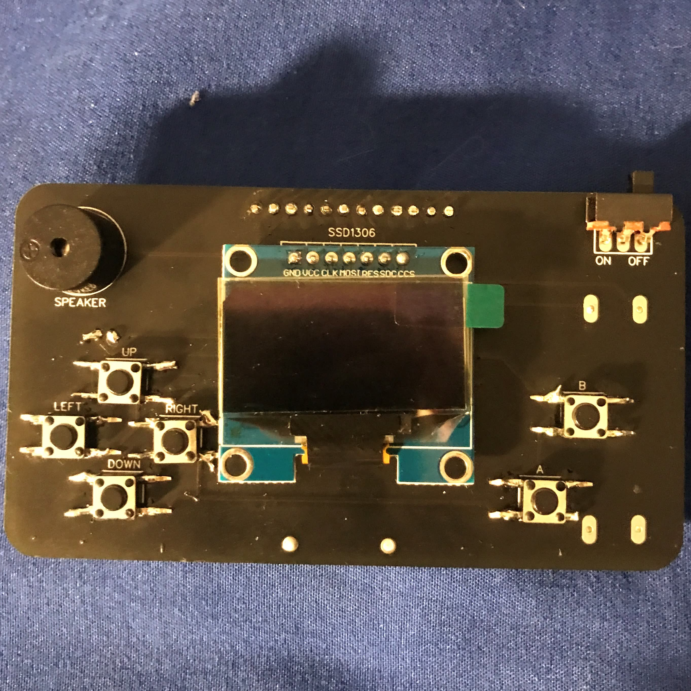
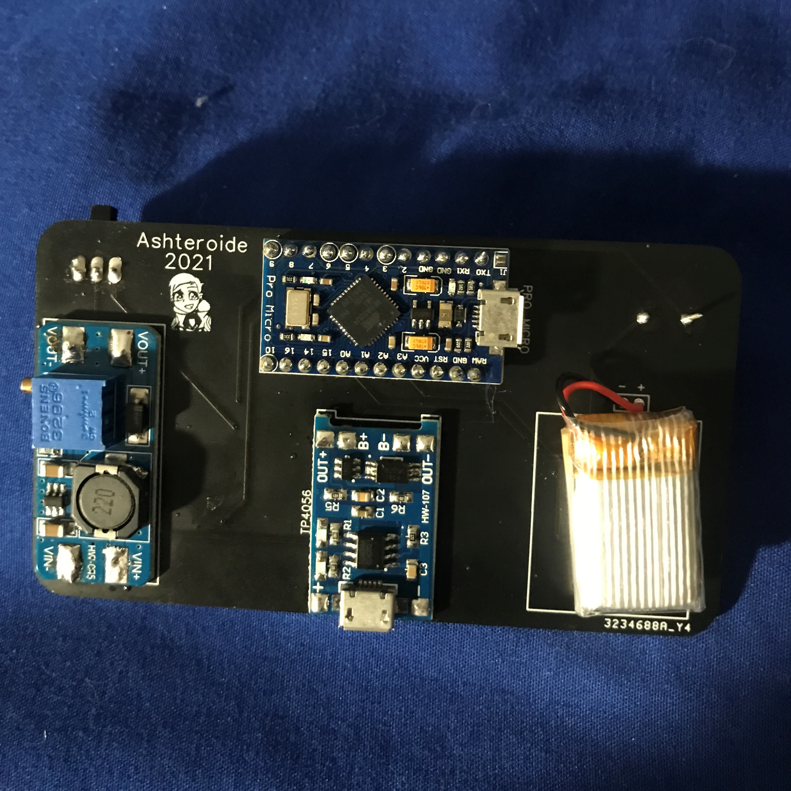

# Mk3-Ashteroides-Homemade-Arduboy
Majority of details are available here: https://community.arduboy.com/t/ashteroides-mk3-homemade-arduboy/10124

<h2>But here's it relisted:</h2>

<h2>Images</h2>

<h2>Parts List</h2>
* 6x Momentary push buttons 6x6mm 4 pins
* MT3608 - Stepup voltage converter
* TP4056 - Battery charging
* 3.7v 150mAh LiPo battery
* SH1106 or SSD1306 (It supports most screens but requires a different library for uploading, details further down)
* Piezo Speaker (I’m unsure which one specifically)
* Arduino/Sparkfun Pro Micro 5v 16Mhz
* Standard 3 pin switch

<h2>Gerber Files</h2>
Available through the latest release

<h2>Other Details</h2>

This was designed because my other homemade Arduboy had broken and I needed a new one, other designs had a lot of other stuff or different parts so I opted to make my own, through trial and error I was able to reach Mk3 (Mk1 and Mk2 failed unfortunately). The Battery does receive 4.2v so I highly recommend a battery with a circuit protection (I don't think it causes any issues with it though)

I am not a professional PCB designer nor am I fully aware of electronics, I have common knowledge collected over a long time so if it breaks for you sorry.

**Note** *Keep your eyes peeled for a Mk4, it’ll be credit card sized and for the more advanced users to make, I am majorly debugging the PCB so it’ll be a while but I hope to get something out either this year or half way through next year*
